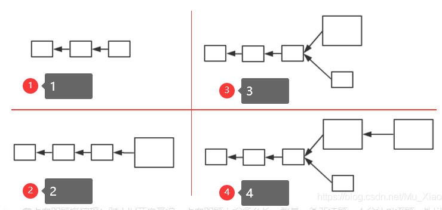
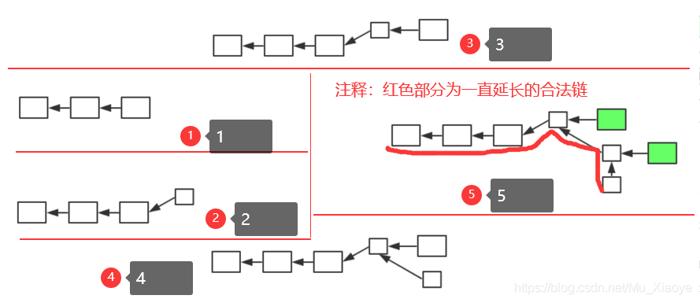

# 《区块链技术与应用》(六)——BTC分叉篇

## 分叉

分叉指的是，原来的系统中为一条链，但分成了两条链。分叉形成的原因可能有多种，例如：挖矿时两个节点差不多同时挖出矿，都会发布区块(对比特币系统当前状态产生分歧导致的分叉——state fork)；分叉攻击，同样也会导致分叉(forking attack，人为故意造成)；比特币协议改变，在分布式系统中不能保证所有节点同时升级软件，假设存在少数节点未升级，导致出现分叉(protocal fork)；

> ​	根据对比特币协议修改的不同，可以将分叉分为硬分叉和软分叉。

## 硬分叉(hard fork)

> ​		**什么情况会出现硬分叉？**
> ​		 对比特币协议增加新协议，扩展新功能，**未升级软件的旧节点会不认可这些修改，会认为这些特性是非法的**。这也就是对比特币协议内容产生分歧，从而导致分叉。硬分叉的一个典型例子，就是对比特币区块大小的修改（之前有提到过，BTC区块大小限制1MB，但是否合适存在争议）。

在BTC系统中，区块大小最大为1MB，可以包含的交易最大数量为4000笔左右。而一个区块产生大概需要10min左右，也就是说，整个比特币系统，**平均每10分钟最多只能处理4000笔交易(平均每秒7笔交易)**，相比目前银行等金融机构每秒数十万数百万的交易量来说，根本不在一个数量级上，严重影响吞吐率和交易处理(即上链)时间(因为交易太多，无法写入只能等待下一个区块)。
所以，有人便认为可以增大区块大小，使得一个区块中可以包含的交易数量增多，在此，我们假设将区块大小从1MB增大至4MB。

> 假设系统中大多数节点更新了软件，少数节点仍然遵从1MB限制的协议(注意，这里大多数和少数是按照算力来区分的，和账户数量无关)。即：新节点认为区块大小最大4MB，旧节点认为区块大小最大1MB，且新节点占据大多数。

> 假设1为当前区块链，此时软件更新，有一个新节点挖出了一个区块如2。**但对于旧节点来说，该区块为一个非法区块，旧节点不会对其认可，从而，旧节点仍然从其前一个区块开始挖矿，如3.**
> 需要注意的是，旧节点挖出的区块，新节点是认可的(并未超过4MB限制)，**所以对旧节点来说，3中下面的链才是合法链，而对新节点来说，这两条链都是合法的链**。因为新节点算力强，所以出现4中情况可能性大。**对于新节点来说，上面的为最长合法链，新节点便都会沿着上面的链继续挖；**对于旧节点来说，上面的链无论多么长，都是一条非法链，不会认可该链，所以旧节点就会沿着下面的链继续挖矿。
>
> **此时，就出现了新节点永远沿着上面的链挖矿，旧节点永远沿着下面的链挖矿，由于新节点算力足够强，所以形成两条永远都在延伸且平行的链。**
>
> **当然，上面的链，也有可能会挖出大小在1MB内的小区块，但对旧节点来说，该链上存在非法区块，不会认可该链。可见，这种分叉是持久性的。**
> **只要这部分旧节点永远不更新软件，下面的链便永远不会消失。**

> 1.BTC社区中有些人很保守，不愿意加大区块大小 
>
> 2.区块大小并非越大越好，在网络篇中提到，比特币网络传输为"尽力而为"，区块加大会造成传输变慢等问题。 
>
> 3.单纯增加区块大小，对交易数量的增加远不能达到数量级的提升。

出现hard fork后，便变成了两条平行的链，也就造成了社区分裂。社区中有一部分人，会认为下面的链才是”正统“(根正苗红)，各个链上的货币独立。

> 实际上，这个事情真正出现过。后续会介绍以太坊，以太坊历史上的一件大事就是硬分叉事件。以太坊称为ETH，但目前看到的ETH已经不是最初的ETH了，以太坊在历史上发生过硬分叉，另一个链称为ETC。实际上，ETC才是以太坊设计原本的协议，而ETH是黑客攻击ETH上一个智能合约THE DAO后进行回滚的协议链(将黑客攻击偷取的以太币采用硬分叉方式回滚回到另一智能合约，然后退还给真正拥者)。
> 但是这次硬分叉的后果，由于有人不愿意这么做，造成了以太坊社区的分裂。实际上，虽然ETC不如ETH又名，但实际它也是目前一种主流货币。
>
> **曾经出现过这样的问题:**
>
> 分叉前有A→B的交易，分叉后在上面链出现了B→C，下面链也出现了B→C，因为账户，私钥都是一样的。既然如此，就会有人利用这个特性，想收到上下两条链的转账。但如果没有人转账给他怎么办？
>
> 可以这样做:比如说B去购物，花一笔钱，给了C。后来B要退货，要取消这笔交易，C又把钱交给B。然后B又在下面一条链进行回放，就赚了一笔钱。那么在开始B转给C的交易在下面链会不会回放呢？所以这样做也是有风险的。为了解决这个问题，就让这两条链各带一个chain ID，所以现在以太坊的分叉已经没有问题了，就是两条独立运行的链了。

## 软分叉（soft fork）

如果对BTC协议添加限制，使得原本合法交易在新交易中不合法，便会形成软分叉。

同样，有人想将区块大小调大，也就会有人思考调小的好处。在这里，我们**假设将区块大小从1MB减小至0.5MB**(实际中，1MB已经足够小，不会调小了).

> ​         需要注意的是，区块链中区块大小调整并非简单修改一个参数，调改大小便很有可能会引发分叉，由于参数修改方式不同，有可能会是硬分叉，也有可能是软分叉。

> ​		 假设系统中大多数节点更新了软件，少数节点仍然遵从1MB限制的协议(注意，这里大多数和少数是按照算力来区分的，和账户数量无关)。即：**新节点认为区块大小最大0.5MB，旧节点认为区块大小最大1MB，且新节点占据大多数**。

> 假设1为当前区块链，此时软件更新，有一个新节点挖出了一个区块如2。但对于旧节点来说，该区块符合1MB大小限制，旧节点对其认可，从而旧节点会沿着该新的小区块开始挖矿，如3.
> **但是新节点会认为该旧节点挖出区块超过0.5MB限制，为一个非法区块，不会认可该区块，会从其前一个小区块开始挖矿。如4所示。**
> 而旧节点认可新区块，最终会造成5中的效果(绿色大节点为旧节点)，旧节点挖出的区块一直被抛弃，无法得到出块奖励(不在最长合法链上)。这就倒逼旧节点升级软件，最终会实现区块链上的所有矿工共同认可新协议，实现软件协议的升级。
>
> 需要注意的是，旧节点如果不升级软件，挖出的区块可能就白挖了(大于0.5MB)，但对于系统来说，不会存在永久性分叉。

## 系统中可能出现软分叉的情况及其实例

> **1、给某些目前协议中未规定的域赋予新的含义或规则。**
> 最经典的就是，铸币交易中CoinBase域。在CoinBase域中写入任何内容都可以，没有任何规定。之前，在介绍挖矿时，提到挖矿本质是调整block header中的nonce，但其本身只有4个字节，搜索空间太小。**所以实际使用中，将CoinBase域前8个字节作为另一个extra nonce，此时搜索空间从原本2^32 增长到2^96，对于目前挖矿难度来说已经足够。**
> **但CoinBase中并不是只有8个字节，还剩下很多空间。**有人便提出将其作为UTXO(当前还没花掉的交易结合，在数据结构篇中有详细介绍，还记得吗？)集合的根哈希值。目前UTXO是全节点自己在本地为了方便查询自行维护的，但UTXO内容并未写入区块链（还记得Merkle proof吗？Merkle proof用于验证某个交易是否在区块中，Merkle proof的交易信息是写入区块链的。）
> **由于UTXO存在本地，如果查询某账户余额，轻节点便需要询问全节点，全节点根据UTXO中信息可以计算得到账户余额，但如何确保全节点给的数据可信？由于直接修改block header会造成硬分叉，有人便提出了以上的方案(该域刚好无人用)。**
> 可以看到，旧节点认可新节点的区块，但新节点对于旧节点CoinBase域检查时候，发行并没有这个UTXO的根哈希值，不会认可其发布的区块，所以这是软分叉.

> > **2、P2SH：Pay to Script Hash**
> > 还记得上一篇比特币脚本中该功能吗？上一篇中提到过，最初比特币版本中没有该功能，后来通过软分叉方法加入了进去。

> **比特币历史上比较著名的软分叉的例子是pay to script hash。**
>
> ​			P2SH这个功能在最初的比特币版本里是没有的，它是后来通过软分叉的功能给加进去的。这是什么意思呢?你支付的时候不是付给一个public key的哈希，而是付给一个赎回脚本的哈希。花钱的时候要把这个交易的输入脚本跟前面币的来源的交易的输出脚本拼接在一起执行。执行的时候验证分为两步，第一步是要验证输入脚本中给出的redeem script跟前面那个输出脚本给出的script的哈希值是对的上的，证明输入脚本里提供的script是正确的。第二步再执行redeem script，来验证输入脚本里给出的签名是合法的。
>
> ​			对于旧节点来说，它不知道P2SH的特性，只会做第一阶段的验证，即验证redeem script是否正确。新节点才会做第二阶段的验证，所以旧节点认为合法的交易新节点可能认为是非法的(如果第二阶段的验证通不过的话)。而新节点认为合法的交易旧节点肯定认为是合法的，因为旧节点只验证第一阶段。
>
> **总结:**soft fork是什么?只要系统中拥有半数以上算力的节点更新了软件，那么系统就不会出现永久性的分叉，只可能有一些临时性的分叉。hard fork特点是什么？必须是所有的节点都要更新软件，系统才不会出现永久性的分叉，如果有小部分节点不愿意更新，那么系统就会分成两条链。

## merkle proof能证明什么？

​			证明某个交易是不是在给定的区块里。比如一个轻节点，没有维护整个区块的内容，只知道block header。轻节点问一个全节点:该交易是不是在这个区块里?全节点返回一个merkle proof作为证明，轻节点就可以验证是否属实。但如果是另外一种情况，想要证明某个账户上有多少钱，这个目前在比特币系统中是证不出来的。如果是全节点还可以算一下，方法如下:想要知道A账户有多少钱，就看一下A在UTXO里对应的输出总共收到多少个币，就是该账户上有多少钱。

​			对于全节点是可以算出来的，但如果是区块链钱包、有的手机上的APP，它不可能在手机上维护一个完整的区块链，它实际上是个轻节点，它想要知道账户的余额需要询问全节点。**全节点返回一个结果，怎么知道这个结果是否属实呢？**现在是证不出来的。如果你自己不维护一个UTXO集合，就没法用merkle proof 证出来。

​			有人提议把UTXO集合当中的内容也组织成一颗merkle tree，这个merkle tree有一个根哈希值，根哈希值写在coinbase域里面。因为block header没法再改了，改block header动静就太大了，coinbase域正好是没人用的，所以就写入UTXO的根哈希值。**coinbase域当中的内容最终往上传递的时候会传递到block header里的根哈希值里。**所以改coinbase域的内容，根哈希值会跟着改。因此这个提案就是说把UTXO集合的内容组织成merkle tree，算出一个根哈希值来，写入coinbase域里某个位置。**coinbase域的内容本身也会算哈希，算到block header里的根哈希值，这样就可以用merkle proof证出来了。**

​			假设有人发布一个软件更新，规定coinbase域要按照这个要求来填写，大多数节点都升级了软件，少数节点没有更新，这属于软分叉，因为新节点发布的区块旧节点认为是合法的，因为旧节点不管新节点写什么内容。但旧节点发布的区块新节点可能是不认的，因为如果coinbase域不按要求写它是不认的，所以属于软分叉。

> ## 总结
>
> > - soft fork
> >   特点：只要系统中拥有半数以上算力节点更新软件，系统就不会产生永久性分叉
> > - hard fork
> >   特点：必须系统中所有节点更新软件，系统才不会产生永久性分叉
